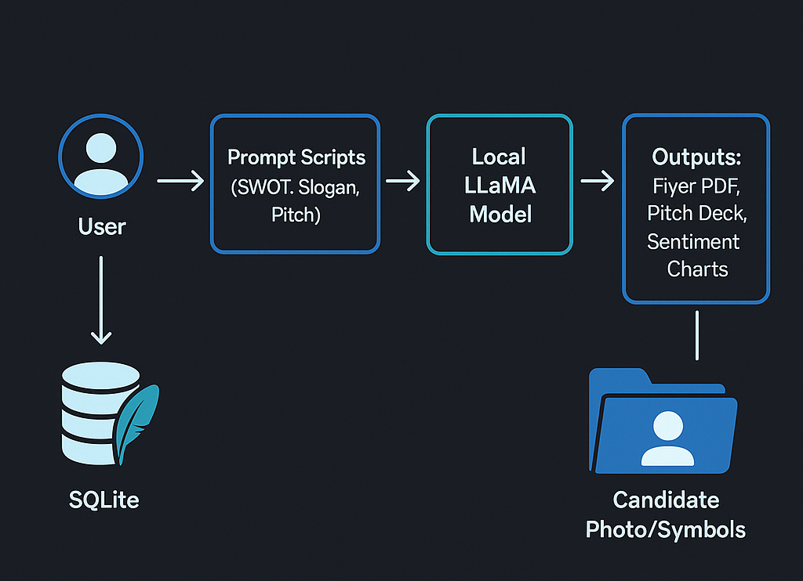

<p align="center">
  
</p>

<p align="center">
  
  
  
  
  
  
  
  
</p>

---

# 🗳️ voteR – AI Political Analysis Engine

- Campaign intelligence to understand voter mood, identify winning issues, and generate high-impact flyers, slogans, and pitch decks — now **Groq-first** with an optional **Vertex AI** path.  
- Hybrid retrieval (OpenSearch BM25 → embedding re-rank) + LangChain orchestration for reliable, auditable outputs.

---

## ⚠️ Showcase-Only (Under NDA)

This repository demonstrates the **architecture**, **workflow**, and **sample outcomes** of the voteR platform.  
🔒 The full production code and datasets are **proprietary** and available **under NDA**.

Want to see it running?  
📧 **akar@akar7a.onmicrosoft.com** — I’ll demo it for you.

---

## 🧠 Problem → Solution

### ❌ The Problem
- Candidates struggle to interpret voter sentiment in real time.  
- Generic slogans and flyers fail to resonate locally.  
- Campaign assets are often created without measurable evidence.

### ✅ The Solution
- 🔍 AI pipelines analyze real voter sentiment from public signals.  
- 🎯 Issues, slogans, and flyers are **personalized per constituency**.  
- 📊 Pitch decks are auto-generated to guide campaign strategy with metrics.

*Designed for low cost and clear audit trails.*

---

## 🧰 Tech Stack

- **Core:** Python 3.10+, Streamlit (UI), SQLite (local), ReportLab (PDF), pandas/matplotlib (viz)  
- **LLM:** **Groq API (primary)** · **Vertex AI (optional, serverless inference with usage caps)**  
- **Orchestration:** LangChain (prompts, tools, chains)  
- **Search & Retrieval:** **OpenSearch (BM25)** → **Hugging Face sentence-transformers re-rank**  
- **Vector Stores:** **FAISS** · **Weaviate** (toggle via env)  
- **Experiment Tracking:** **MLflow** (quality, latency, unit-cost; reproducible runs)

 - Air-gapped / offline mode is still possible using local LLMs, but v2 targets Groq by default.

---

## 🧬 Architecture

<p align="center">
  
</p>

**High-level flow:**  
`operator → Streamlit → LangChain chain → retrieval (OpenSearch/FAISS/Weaviate) → re-rank → LLM (Groq | Vertex AI) → evaluation/logging (MLflow) → PDF`

**Guardrails:** token/output caps, rate limits, per-route allowlist for Vertex, and cost-aware prompts.

---

## 🧾 What’s Inside (and what’s not)

- ✅ Sample flyers, pitch decks, and a system-generated video  
- ✅ Safe Python snippets from prompt modules  
- ✅ Architecture + UI banners  
- ❌ No private data or full source code  
- ❌ No `.env`, secrets, or voter database

---

## 🖼️ Samples

- 🧾 **Campaign Flyers**: [`flyer1.pdf`](samples/flyer1.pdf), [`flyer2.pdf`](samples/flyer2.pdf)  
- 📊 **Pitch Deck**: [`pitch_deck1.pdf`](samples/pitch_deck1.pdf)  
- 🎥 **Pitch Deck Video**: [`video_pd.mp4`](samples/video_pd.mp4)

_All assets above are auto-generated by the system._

---

## 🧩 Sample Code Snippet

This harmless utility is used inside the PDF generator:

```python
from reportlab.lib.pagesizes import A4
from reportlab.pdfgen import canvas

def generate_flyer(candidate_name, slogan, output_file):
    c = canvas.Canvas(output_file, pagesize=A4)
    c.setFont("Helvetica-Bold", 20)
    c.drawString(100, 750, f"Vote for {candidate_name}!")
    c.setFont("Helvetica", 14)
    c.drawString(100, 720, f"Slogan: {slogan}")
    c.save()
